[](https://app.fossa.io/projects/git%2Bgithub.com%2Fchainweaver%2Fprotobuf?ref=badge_shield)
[](https://circleci.com/gh/chainweaver/protobuf/tree/master)

# Interface Definition of Chainweaver API

## Build Flow



## For developer

In this project you can develop by preparing the following environment.

* Be able to use the `make` command
* Docker daemon is running on your machine

### Build

```
make build
```

### Test REST API with postman

```
export BASE_URL=URL
export TOKEN=YOUR_TOKEN
make test
```

## Reference

* [https://grpc.io/](https://grpc.io/)
* [https://developers.google.com/protocol-buffers/](https://developers.google.com/protocol-buffers/)
* [https://github.com/grpc-ecosystem/grpc-gateway](https://github.com/grpc-ecosystem/grpc-gateway)
* [https://github.com/golang/protobuf](https://github.com/golang/protobuf)
* [https://github.com/pseudomuto/protoc-gen-doc](https://github.com/pseudomuto/protoc-gen-doc)
* [https://www.getpostman.com/](https://www.getpostman.com/)

## License Scan
[](https://app.fossa.io/projects/git%2Bgithub.com%2Fchainweaver%2Fprotobuf?ref=badge_large)
